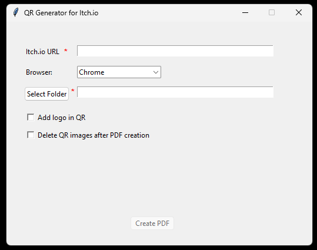

# 🧭 Guía de uso — QR Generator for Itch.io (.exe)

Esta aplicación genera códigos QR en PDF con los enlaces de los juegos de una jam en [Itch.io](https://itch.io).  
No necesita tener Python instalado — basta con ejecutar el archivo **`.exe`**.

---

## 🚀 1. Abrir la aplicación

1. Descarga el archivo `QR_Generator_Itchio.exe` desde la sección de **Releases** de este repositorio (o desde la carpeta `dist/` si lo has compilado tú mismo).  
2. Haz **doble clic** sobre el archivo `.exe`.  
3. Espera unos segundos mientras se abre la ventana principal de la aplicación.

> 💡 No se necesita instalar nada adicional. Los controladores de navegador (Chrome, Firefox o Edge) se descargan automáticamente la primera vez que se ejecuta el programa.

---

## 🖥️ 2. Interfaz principal

Así se ve la ventana principal del programa:

Cada elemento tiene una función:

| Elemento | Obligatorio | Descripción |
|-----------|--------------|--------------|
| **Itchio URL** | ✅ Sí | Enlace a la página de entradas de la jam |
| **Select Folder** | ✅ Sí | Carpeta donde se guardará el PDF y las imágenes QR|
| **Browser**  | ❌ No | Navegador que usará el programa (Chrome, Firefox o Edge)|
| **Add logo in QR**  | ❌ No | Permite añadir un logo en el centro del QR|
| **Delete QR images after PDF creation**  | ❌ No | Elimina los QR individuales tras crear el PDF|
| **Create PDF** | — | Inicia el proceso de generación del PDF. Solo se activa si los campos obligatorios están rellenados|

---

## 🔗 3. Formato de la URL (Muy importante)

Para que el programa funcione correctamente, **la URL debe ser la página de “entries” de una jam de Itch.io**.  
Debe tener este formato exacto:

``
https://itch.io/jam/nombre-jam/entries
``

✅ Ejemplo correcto: <https://itch.io/jam/malagajam-weekend-19/entries>

❌ Ejemplo incorrecto: <https://itch.io/c/5264911/malagajam-weekend19>

---

## 📁 4. Seleccionar carpeta de destino

1. Pulsa el botón **“Select Folder”**.  
2. Elige una carpeta donde se guardarán:
   - Los códigos QR individuales (carpeta `Games_QR/Qrs`)
   - El PDF final con todos los QR (`Games_QR/Games_QRs.pdf`)

> ⚠️ Si seleccionas una carpeta sin permisos de escritura, el programa mostrará un error.

---

## 🖼️ 5. (Opcional) Añadir un logo al centro del QR

1. Marca la casilla **“Add logo in QR”**.  
2. Haz clic en **“Select Logo”** y elige un archivo de imagen (`.png` o `.jpg`).  
3. Este logo se insertará en el centro de cada código QR en el PDF.

> 💡 Se recomienda usar un logo **pequeño y cuadrado** (por ejemplo, 100×100 píxeles) para mantener la legibilidad del QR.

---

## 🧹 6. (Opcional) Eliminar los QR después de crear el PDF

- Si marcas **“Delete QR images after PDF creation”**,  
  el programa borrará automáticamente la carpeta `Qrs/` después de crear el PDF.

> Si quieres conservar las imágenes individuales, **no marques** esta opción.

---

## 📄 7. Crear el PDF

Cuando todo esté listo:

1. Verifica que:
   - La URL está escrita correctamente.  
   - La carpeta de guardado aparece en el campo correspondiente.  
2. Pulsa **“Create PDF”**.  

Aparecerá una ventana de progreso que mostrará los pasos:

- 🔹 *“Abriendo navegador Chrome…”*  
- 🔹 *“Descargando información de juegos…”*  
- 🔹 *“Generando códigos QR…”*  
- 🔹 *“Creando PDF…”*  

Al finalizar, verás el mensaje ✅ **“PDF successfully created!”**

---

## 📘 8. Archivos generados

En la carpeta seleccionada se creará una estructura como esta:

📁 Games_QR/

├── 📁 Qrs/ → Imágenes QR individuales

└── 📄 Games_QRs.pdf → PDF final con todos los QR

> Si activaste la opción *“Delete QR images after PDF creation”*,  
> la carpeta `Qrs/` se eliminará automáticamente después de crear el PDF.

---

## 💡 9. Consejos y problemas comunes

| Problema | Posible causa / solución |
|-----------|---------------------------|
| ❌ *No se encontraron enlaces de juegos.* | La URL no termina en `/entries` o la jam no tiene juegos aún. |
| ⚠️ *Error al abrir el navegador* | Asegúrate de tener instalado Chrome, Firefox o Edge. |
| 🚫 *Create PDF sigue deshabilitado* | Comprueba que los campos de URL y Folder estén rellenados. |
| 🧱 *El .exe tarda en iniciar la primera vez* | Está descargando los drivers del navegador (solo ocurre una vez). |

---

## 🧾 10. Créditos y licencia

- Desarrollado por Gonzalo Estrada Rojo para MalagaJam
- Librerías usadas: `Selenium`, `qrcode`, `Pillow`, `ReportLab`, `webdriver-manager`, `Tkinter`
- Proyecto open source. Puedes modificarlo, distribuirlo y adaptarlo libremente.

---

✨ **Listo!**  
Con esta guía, cualquier usuario puede descargar el `.exe` y generar sus códigos QR en PDF sin tocar código ni instalar Python.
